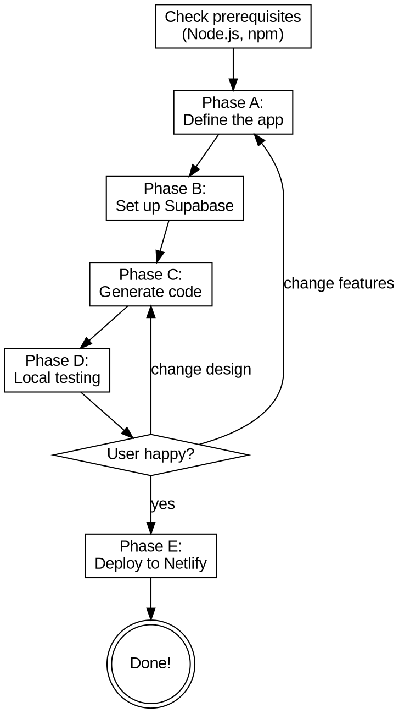

# Build a Fullstack Web Application

Guide a non-technical user through building a complete web application from scratch. The user describes what they want, and you build everything - from the database to the frontend to deployment.

**Stack:** React (Vite) + Supabase (Database + Auth) + Tailwind CSS + Netlify
**Prerequisites:** Node.js v18+ (skill checks and guides installation)

## Interaction Style

Talk to the user in simple Hebrew. They have zero technical background. Never use jargon without explaining it. The principle: **"I do, you decide"** - you perform all technical actions (writing code, setting up databases, deploying). The user only makes decisions about what the app does and how it looks.

**STOP for:** Account creation (Supabase, Netlify), password entry, payment information. Say: "אני לא מכניס סיסמאות או פרטי תשלום בשבילך - זה בשבילך לעשות."

## Flow



## Prerequisites Check

Before starting, check system readiness:

1. Run `node --version`. If missing or below v18:
   - **"כדי לבנות אפליקציית ווב, צריך כלי שנקרא Node.js. אני אעזור לך להתקין אותו - זה לוקח דקה."**
   - Mac: `brew install node` (or guide to nodejs.org if no brew)
   - Windows: Guide to nodejs.org download via computer-use
   - Linux: `curl -fsSL https://deb.nodesource.com/setup_20.x | sudo -E bash - && sudo apt-get install -y nodejs`

2. Run `npm --version` to verify npm came with Node.

3. Check `git --version` (optional - needed for Netlify CLI, but drag-and-drop deploy works without it).

If Node.js found: **"Node.js מותקן. מעולה, אפשר להתחיל!"**

## Phase A: Define the App (Free Conversation)

Have a natural conversation in Hebrew. Ask one question at a time:

1. **"מה האפליקציה צריכה לעשות? ספר לי במילים שלך, כאילו אתה מסביר לחבר."**
   - Get the core purpose (task manager, CRM, blog, portfolio, etc.)

2. **"מי ישתמש באפליקציה? רק אתה? צוות? לקוחות?"**
   - Determines auth requirements:
     - Only me / one person → simple auth or no auth
     - Team / multiple users → Supabase Auth with email
     - Public visitors → no auth needed

3. **"תתאר לי מה אתה רואה כשאתה פותח את האפליקציה. מה המסך הראשי?"**
   - Gets the main dashboard / homepage concept

4. **"מה הפעולות העיקריות? למשל: להוסיף משהו, למחוק, לערוך, לחפש?"**
   - Maps CRUD operations and key actions

5. **"יש עוד עמודים שצריך? למשל: עמוד הגדרות, רשימה, דוח, פרופיל?"**
   - Gets the page structure / routes

6. **"איך אתה רוצה שזה ייראה? מודרני ונקי? צבעוני? מינימלי? יש צבע מועדף?"**
   - Gets design preferences

After the conversation, build and present an **App Spec** in Hebrew:

```
הנה מה שהבנתי על האפליקציה שלך:

שם: [App Name]
מטרה: [One-line purpose]

עמודים:
1. [Page name] - [description]
2. [Page name] - [description]

פיצ'רים:
- [Feature 1]
- [Feature 2]

טבלאות נתונים:
- [Table 1]: [fields in Hebrew]
- [Table 2]: [fields in Hebrew]

התחברות: [כן/לא, ואיך]
עיצוב: [style description]

זה מתאים? תגיד לי אם יש משהו לשנות.
```

Iterate until the user approves. This App Spec drives all subsequent phases.

## Phase B: Set Up Supabase

**"עכשיו נגדיר את בסיס הנתונים - המקום שבו האפליקציה שומרת מידע. אנחנו משתמשים בשירות חינמי שנקרא Supabase."**

### B1: Account

**"יש לך חשבון Supabase? אם לא, בוא ניצור אחד."**

- Navigate to https://supabase.com via computer-use
- **STOP**: "תירשם - אפשר עם Gmail. אני לא מכניס סיסמאות בשבילך."
- Wait for user to confirm they are logged in.

### B2: Create Project

- Guide to create new project
- **"תן שם לפרויקט (למשל: [APP_NAME]) ובחר סיסמה לבסיס הנתונים. תשמור את הסיסמה!"**
- **STOP**: User enters database password
- Select region closest to Israel (Frankfurt / eu-central-1)
- Wait for project creation (1-2 min)

### B3: Get Credentials

- Navigate to Project Settings → API
- Copy `Project URL` and `anon/public key`
- Create `.env` file:
  ```
  VITE_SUPABASE_URL=https://xxxxx.supabase.co
  VITE_SUPABASE_ANON_KEY=eyJhbGciOi...
  ```
- **"שמרתי את הפרטים. האפליקציה שלך תדע להתחבר לבסיס הנתונים."**

### B4: Create Tables

Based on the App Spec from Phase A:

- Navigate to SQL Editor in Supabase dashboard
- Generate and execute CREATE TABLE statements
- Include Row Level Security (RLS):
  - No auth app → enable RLS with permissive policies (allow all for anon)
  - Auth app → enable RLS with user-scoped policies (`auth.uid() = user_id`)
- **"יצרתי את הטבלאות. הנה מה שנוצר: [table summary in Hebrew]"**

### B5: Enable Auth (if needed)

If the App Spec requires auth:
- Navigate to Auth → Providers in Supabase dashboard
- Enable Email provider
- Set redirect URL to `http://localhost:5173`
- **"הפעלתי אפשרות התחברות באימייל."**

If no auth needed: skip.

## Phase C: Generate Frontend Code

**"עכשיו אני בונה את האפליקציה. זה ייקח כמה דקות. אתה לא צריך לעשות כלום, רק לחכות."**

### C1: Scaffold

```bash
npm create vite@latest [APP_NAME] -- --template react
cd [APP_NAME]
```

### C2: Install Dependencies

```bash
npm install @supabase/supabase-js react-router-dom
npm install -D tailwindcss @tailwindcss/vite
```

### C3: Project Structure

Always generate this structure:

```
[APP_NAME]/
  .env                          # Supabase credentials (from Phase B)
  .gitignore
  index.html
  package.json
  vite.config.js                # Vite + Tailwind plugin
  netlify.toml                  # SPA redirect for Netlify
  src/
    main.jsx                    # Entry point + router
    App.jsx                     # Root component
    index.css                   # Tailwind imports
    lib/
      supabase.js               # Supabase client singleton
    components/
      Layout.jsx                # Shared layout (navbar, content area)
      Navbar.jsx                # Navigation
      ProtectedRoute.jsx        # Auth guard (if auth enabled)
      ui/
        Button.jsx
        Input.jsx
        Card.jsx
        Modal.jsx
        LoadingSpinner.jsx
    pages/
      HomePage.jsx              # Main dashboard
      [FeaturePage].jsx         # One per feature from App Spec
      LoginPage.jsx             # Only if auth enabled
      NotFoundPage.jsx          # 404
    hooks/
      useAuth.js                # Auth hook (if auth enabled)
```

### C4: Code Generation Conventions

Follow these conventions for ALL generated code:

**Convention 1 - Supabase Client** (`src/lib/supabase.js`):
```javascript
import { createClient } from '@supabase/supabase-js'
const supabaseUrl = import.meta.env.VITE_SUPABASE_URL
const supabaseKey = import.meta.env.VITE_SUPABASE_ANON_KEY
export const supabase = createClient(supabaseUrl, supabaseKey)
```

**Convention 2 - Page Components**:
- Import `supabase` from `../lib/supabase`
- Use `useState` + `useEffect` for data fetching
- Show `LoadingSpinner` during fetch
- Show error message in Hebrew if fetch fails
- Keep state local to the page (no global state manager)

**Convention 3 - CRUD Operations**:
For each data table from the App Spec, generate:
- List/table view with fetch on mount
- Add form (modal or inline)
- Edit capability (inline or modal)
- Delete with confirmation dialog in Hebrew ("אתה בטוח שאתה רוצה למחוק?")
- All Supabase calls in try/catch with Hebrew error messages

**Convention 4 - Styling**:
- Tailwind CSS utility classes only
- RTL support: `dir="rtl"` on root HTML element
- Hebrew font: `font-family: system-ui, -apple-system, sans-serif`
- Responsive: mobile-first with `sm:`, `md:`, `lg:` breakpoints
- Color scheme based on user's preference from Phase A

**Convention 5 - Routing**:
- `react-router-dom` v6+ with `BrowserRouter`
- One route per page from App Spec
- `Layout` component wraps all routes
- 404 catch-all to `NotFoundPage`

**Convention 6 - Auth** (if enabled):
- Login page with email/password
- `useAuth` hook using `supabase.auth.onAuthStateChange`
- `ProtectedRoute` wrapper that redirects to `/login`
- Logout button in Navbar

**Convention 7 - Netlify Config**:
Always generate `netlify.toml`:
```toml
[[redirects]]
  from = "/*"
  to = "/index.html"
  status = 200
```

### C5: Write Files

Generate and write each file. For each:
- Announce in Hebrew: **"יוצר את [filename] - [simple explanation]..."**
- Write the file
- Do NOT show code unless the user asks

### C6: Copy .env

Copy the `.env` from Phase B into the project directory.

### C7: Verify Build

```bash
npm run build
```

Success: **"הקוד נבנה בהצלחה! בוא נבדוק אותו."**
Failure: Read error, fix, rebuild.

## Phase D: Local Testing

**"בוא נראה איך האפליקציה נראית!"**

### D1: Start Dev Server

```bash
cd [APP_NAME]
npm run dev
```

### D2: Preview

Open `http://localhost:5173` in browser (use computer-use or Claude Preview).

**"האפליקציה רצה! תסתכל."**

### D3: Walkthrough

Walk through each page:
**"זה העמוד הראשי. אתה רואה [description]. מה דעתך?"**

### D4: Feedback Loop

**"מה אתה חושב? יש משהו שאתה רוצה לשנות?"**

Use AskUserQuestion with options:
- **"מרוצה, בוא נעלה לאינטרנט"** → Phase E
- **"רוצה לשנות פיצ'רים"** → back to Phase A to update App Spec
- **"רוצה לשנות עיצוב"** → back to Phase C to modify components

For iterative changes, modify only affected files, not everything.

## Phase E: Deploy to Netlify

**"מעולה! עכשיו בוא נעלה את האפליקציה לאינטרנט כדי שכולם יוכלו לראות אותה."**

### E1: Build for Production

```bash
npm run build
```

Creates `dist/` folder.

### E2: Netlify Account

**"יש לך חשבון Netlify? אם לא, בוא ניצור. זה חינם."**

- Navigate to https://app.netlify.com via computer-use
- **STOP**: "תירשם - אפשר עם Gmail או GitHub. אני לא מכניס סיסמאות."
- Wait for user to confirm logged in.

### E3: Deploy

**Strategy A - Netlify CLI** (if git available):
```bash
npm install -g netlify-cli
netlify login        # STOP - user authenticates in browser
netlify deploy --prod --dir=dist
```

**Strategy B - Drag & Drop** (fallback, simpler):
- Navigate to https://app.netlify.com/drop
- **"גרור את תיקיית dist לתוך הדפדפן. אני אראה לך איפה."**
- Use computer-use to show the drop area

### E4: Environment Variables

In Netlify dashboard → Site settings → Environment variables:
- Add `VITE_SUPABASE_URL` and `VITE_SUPABASE_ANON_KEY`
- **Note:** Vite bakes env vars at build time, so the local build already has them. These are for future rebuilds.

### E5: Update Supabase Redirect (if auth)

- Supabase dashboard → Auth → URL Configuration
- Add Netlify URL to Redirect URLs

### E6: Verify

Open the Netlify URL, test key flows.
**"האפליקציה שלך באוויר! הכתובת: [URL]. כל מי שיש לו את הלינק יכול להשתמש."**

### E7: Custom Domain (optional)

**"רוצה כתובת משלך? למשל myapp.com?"**

If yes: guide through Netlify domain settings. **STOP at domain purchase** (payment).
If no: the `.netlify.app` URL works fine.

## Error Handling

| Problem | Hebrew Message | Solution |
|---------|---------------|----------|
| Node.js not installed | "צריך להתקין Node.js. אני אעזור" | Guide installation per OS |
| npm create vite fails | "יש בעיה ביצירת הפרויקט" | Check Node >= 18, try `npx create-vite@latest` |
| npm install fails | "ההתקנה נכשלה" | Delete node_modules + lock file, retry |
| Port 5173 busy | "הפורט תפוס" | Use `--port 5174` or kill process |
| Supabase connection refused | "לא מצליח להתחבר לבסיס הנתונים" | Check .env values, project active |
| RLS blocks queries | "בסיס הנתונים חוסם את הבקשה" | Fix RLS policies |
| Build fails | "הבנייה נכשלה" | Read error, fix imports, rebuild |
| Netlify deploy fails | "ההעלאה נכשלה" | Check dist/ exists, retry |
| 404 on page refresh | "עמודים לא עובדים כשמרעננים" | Verify netlify.toml SPA redirect |
| Auth redirect broken | "ההתחברות לא עובדת" | Update Supabase redirect URLs |
| RTL issues | "הטקסט לא מיושר נכון" | Add dir="rtl" to root, check layout |

## Important Notes

- All communication in Hebrew
- Never show raw code unless the user asks
- Always explain what you're doing in simple terms
- Errors → explain in human terms, not technical
- **STOP** for: account creation, passwords, payment
- Generated app handles: RTL layout, Hebrew text, mobile responsive, loading states, Hebrew error messages
- Use plain JavaScript (.jsx), NOT TypeScript
- Use useState only, NO state management libraries (Redux, Zustand)
- Prefer simple code over clever code - the user or their developer may modify it later
- When iterating (Phase D feedback), modify only affected files
